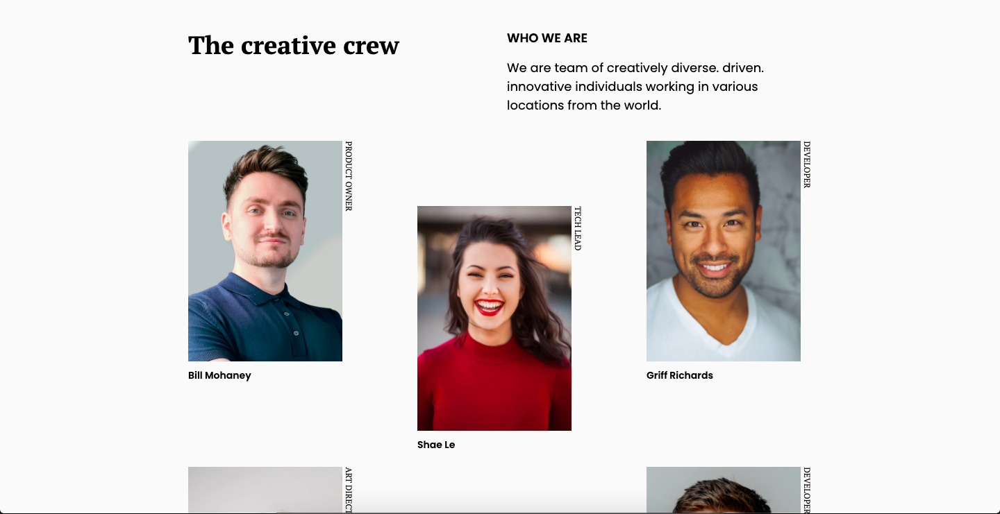

<h1 align="center">My Team</h1>

   Solution for a challenge from  <a href="http://devchallenges.io" target="_blank">Devchallenges.io</a>.

  <h3>
    <a href="https://https://ph-my-team-page.netlify.app">
      Solution
    </a>
     | 
    <a href="https://devchallenges.io/challenges/hhmesazsqgKXrTkYkt0U">
      Challenge
    </a>
  </h3>

<!-- TABLE OF CONTENTS -->

## Table of Contents

- [Overview](#overview)
  - [Built With](#built-with)
- [Features](#features)
- [Contact](#contact)
- [Acknowledgements](#acknowledgements)

<!-- OVERVIEW -->

## Overview

### Built With

- HTML
- CSS
- A lot of CSS GRID

## FEATURES

This application/site was created as a submission to a DevChallenges challenge. The challenge was to build an application to complete the given user stories.

## Acknowledgements

- [How to create an image gallery with CSS Grid](https://www.freecodecamp.org/news/how-to-create-an-image-gallery-with-css-grid-e0f0fd666a5c/)

## Contact

- GitHub [PaulosSouza](https://github.com/PaulosSouza)
- Twitter [Paulo H](https://twitter.com/@Souza13Paulo)
